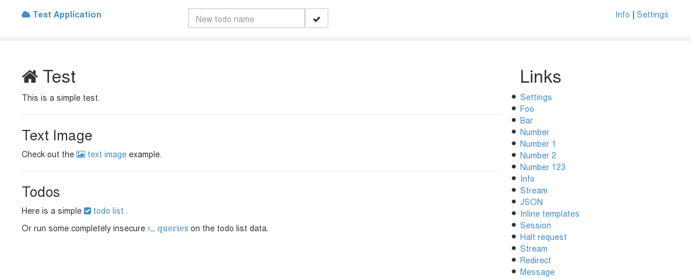
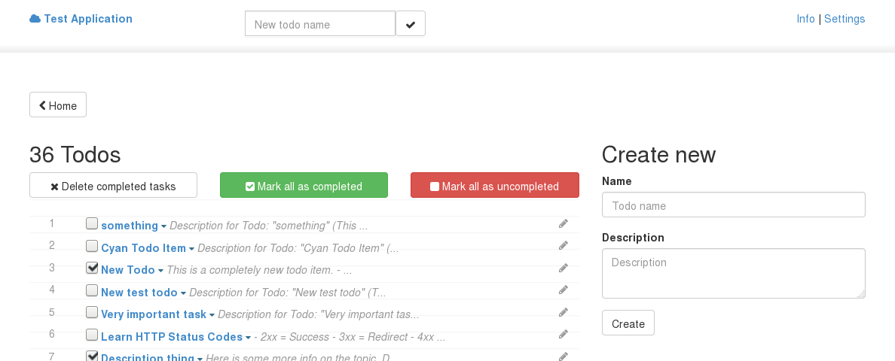
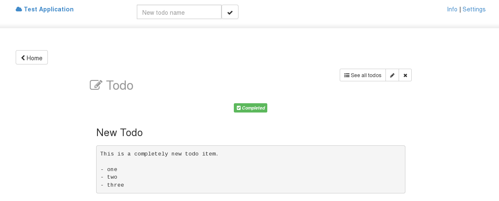
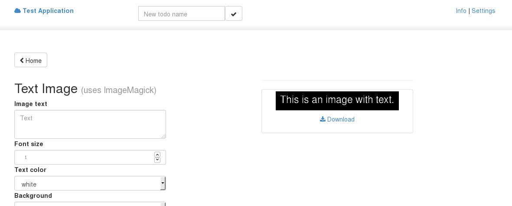
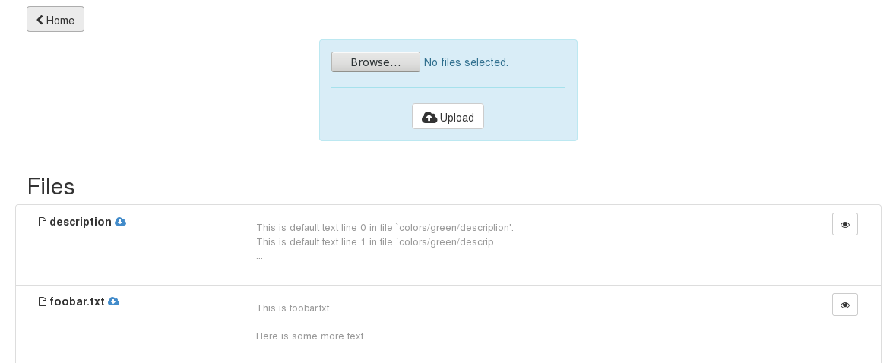
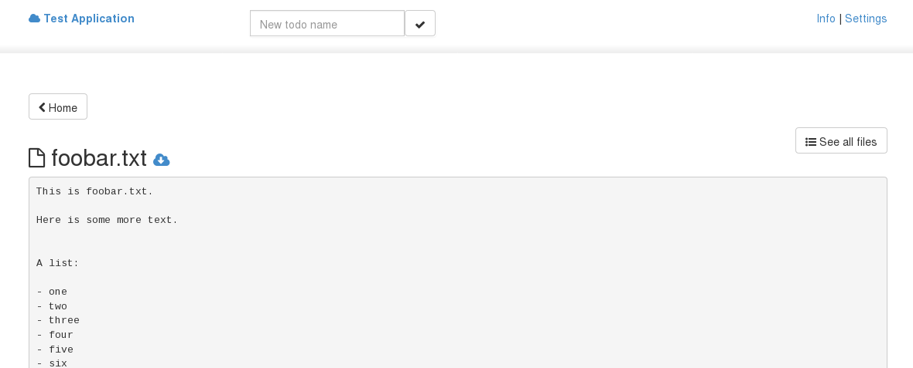
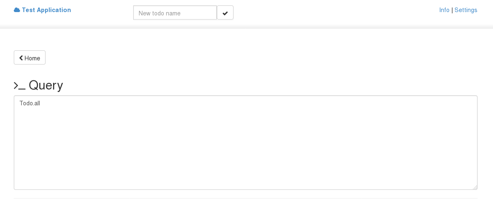
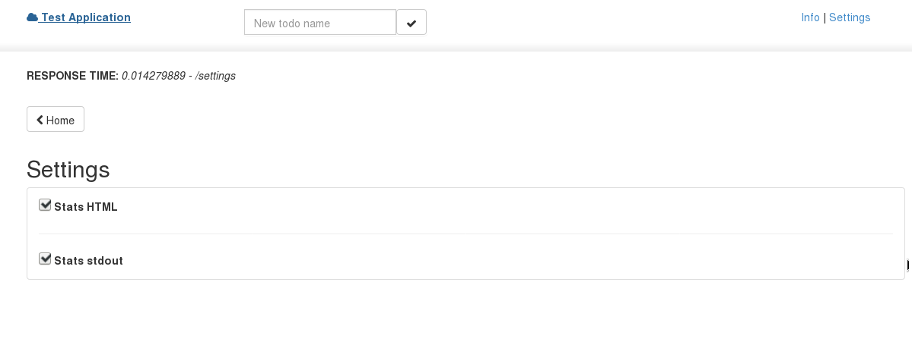
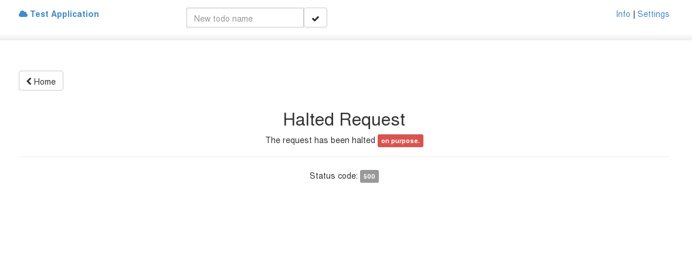

# How to Sinatra

This is a reference app showing how to use Sinatra for various things.

Things covered: 

- streams
- automatic SASS/SCSS conversion
- inline templates
- sessions
- halting requests
- redirecting
- JSON handling
- integrating ActiveRecord
- file serving/downloading
- accessing the user agent
- cookie handling
- accessing routes in templates

## Usage

Fire it up like this:

```
rackup -p 4321
```

Then visit `http://localhost:4321`.

## Screenshots

**Home Page**



**Todos List**



**A Single Todo**



**Text Image Page**



**Files List**



**A Single File**



**Query Page**



**Settings**



**Halted Request**


